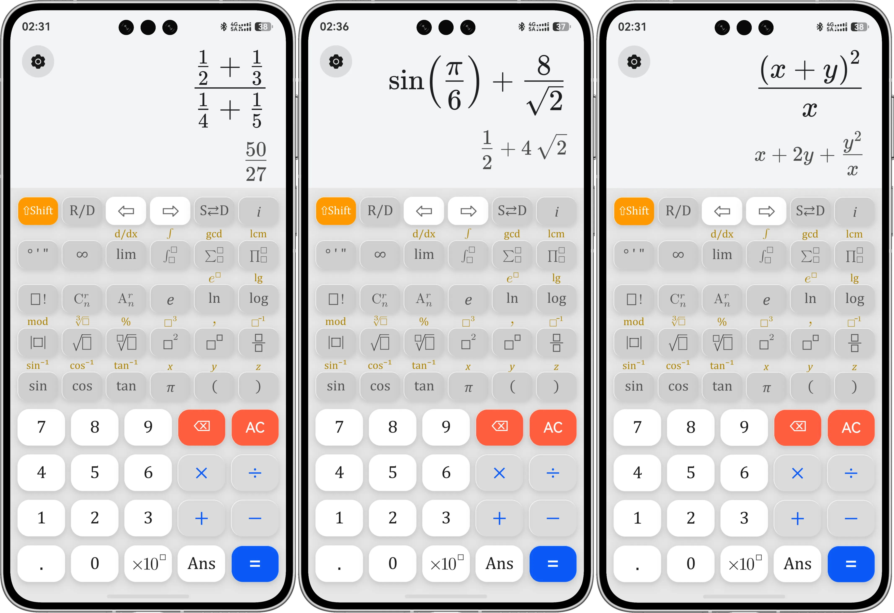
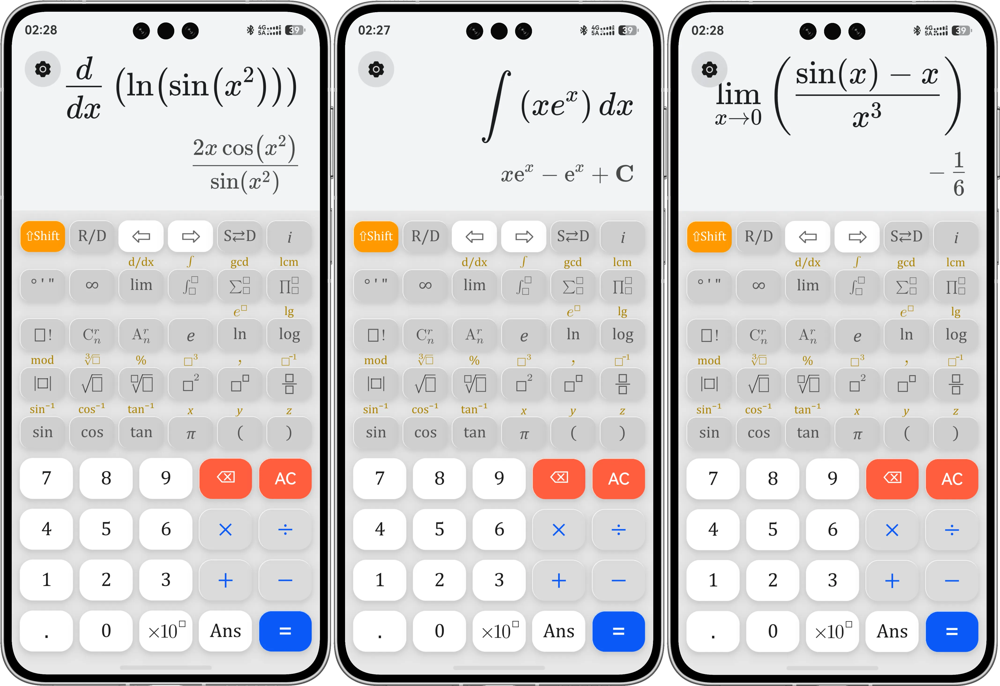

# [CalculatorX](https://calcx.startyi.com) 🚀

[](https://www.gnu.org/licenses/gpl-3.0)

### 🌐 官网：<https://calcx.startyi.com>

## 📝 项目简介
 
CalculatorX 是一款面向 HarmonyOS 的专业符号计算器，支持**精确符号运算**与**高精度数值计算**双模式输出。应用采用"前端 UI + Web 渲染 + 双 C++ 引擎"三层架构，集成 **Giac** 与 **SymEngine** 两大工业级计算机代数系统，覆盖三角函数、排列组合阶乘、根号与次方、分数、极限、定/不定积分、导数、表达式化简等核心功能。计算结果既可直接输出高精度小数，也可保留 $\sqrt{2}$ 、 $\pi$ 、 $e$ 等精确符号形式，提供媲美桌面数学软件的交互体验。

## 🖼️ 界面展示

### 1. 深浅模式


### 2. 基础计算



### 3. 高等数学



### 4. 大数计算


### 5. 设置界面


## 💡 开发环境

DevEco Studio (HarmonyOS)

## 🏗️ 核心架构体系

本项目采用深度融合的三层架构，将计算能力下沉至 C++ 层，通过 N-API 与前端高效协同：

1.  **🧠 UI 控制层 (ArkTS / ArkUI)**
    *   采用声明式 UI 构建原生键盘与功能面板。
    *   实现完善的交互逻辑，包含 `⇧Shift` 状态机拦截、动态字体路由及角度制/弧度制状态管理。
    *   统一调度下层计算资源，根据表达式类型智能路由至对应引擎。

2.  **🎨 渲染引擎层 (Web Component)**
    *   采用 `Web` 组件挂载本地沙箱内的 HTML 文件，核心渲染基于全本地部署的 [MathLive](https://mathlive.io/) 库，支持完全离线运行。
    *   负责出版级 LaTeX 数学公式的高清渲染与双向交互。
    *   承担"数据降维"职责：将复杂的二维 LaTeX 表达式转化为结构化的 **MathJSON** 格式，大幅降低底层 C++ 引擎的解析复杂度。
    *   通过 ArkTS 的 `runJavaScript` 实现跨端 DOM 操作、光标控制与渲染指令通信。

3.  **⚙️ 双引擎计算层 (C++ & N-API)**
    *   底层通过 `CMakeLists.txt` 统一配置编译，静态链接两大计算核心，通过 N-API 向 ArkTS 层暴露统一接口。
    *   **[Giac](https://www-fourier.ujf-grenoble.fr/~parisse/giac.html) 引擎**：负责符号计算核心任务，包括代数化简、微积分（求导/积分/极限）、方程求解、表达式精确符号运算（保留 $\sqrt{2}$ 、 $\pi$ 、 $e$ 等）。
    *   **[SymEngine](https://symengine.org/) 引擎**：负责高精度数值计算与 AST 解析，通过手写 `parseAST` 模块将 MathJSON 转换为内部表达式树，涵盖四则运算、三角函数、对数及常数，同时承担组合数学与特殊函数的快速数值求值。    
    *   **FastMath 模块**：解耦的超大数计算模块，基于对数变换与斯特林近似，实现在 O(1) 时间复杂度下处理 $10^{9000000000000000000}$ 级别的超大阶乘与组合数。
    *   **ErrorHandler 模块**：自定义异常状态机，精准拦截除零、溢出、定义域错误等异常，保障前端无闪退。

## 📂 核心目录结构

```text  
CalculatorX/  
├── AppScope/                              # 全局作用域配置
│   ├── app.json5                          # 全局配置
│   └── resources/base/element/string.json # 全局字符串
│
├── entry/src/main/  
│   ├── ets/                               # ArkTS 前端逻辑与视图层  
│   │   ├── pages/  
│   │   │   ├── settings/                  # 设置
│   │   │   │   ├── Settings.ets           # 设置主页
│   │   │   │   ├── About.ets              # 关于页
│   │   │   │   └── Credits.ets            # 特别鸣谢
│   │   │   ├── Index.ets                  # 主页面：处理按键逻辑、调用 Webview/C++，参数状态映射
│   │   │   └── DocViewer.ets              # 文档展示页：系统级 WebView，负责加载云端协议网页
│   │   │
│   │   ├── components/  
│   │   │   ├── TopKeyboard.ets            # 自定义组件：上方科学计算与微积分键盘
│   │   │   └── BottomKeyboard.ets         # 自定义组件：下方基础数字与四则运算键盘
│   │   │
│   │   └── utils/  
│   │       └── CalculatorConfigs.ets      # 配置文件
│   │  
│   ├── cpp/                               # C++ 计算机代数系统 (CAS) 引擎层
│   │   ├── CMakeLists.txt                 # 构建脚本：配置 N-API，链接 SymEngine 及 Boost
│   │   ├── engine.cpp                     # 核心引擎： AST 树解析、精度控制与 N-API 通信中枢
│   │   ├── ErrorHandler.h                 # 核心模块：自定义异常状态机，精准拦截除零、溢出、定义域等业务错误
│   │   ├── FastMath.h/cpp                 # 核心模块：极速数学降维模块，实现在 O(1) 时间内计算超大数（最大支持10^9000000000000000000）
│   │   ├── boost_1_82_0.tar.gz            # 离线依赖：纯头文件的高性能大数库 (供 SymEngine 使用)
│   │   ├── include/  
│   │   │   └── json.hpp                   # 核心依赖：nlohmann/json，解析 MathJSON 字符串
│   │   ├── giac-1.9.0.tar.gz              # 离线依赖：Giac 符号计算核心
│   │   └── libs/                          
│   │       └── arm64-v8a/                 
│   │           └── libgmp.a               # 编译产物：高精度数学静态库
│   │  
│   ├── resources/  
│   │   ├── base/
│   │   │   ├── profile/
│   │   │   │   └── main_pages.json        # 页面注册表
│   │   │   ├── media/                     # 静态资源：App 图标
│   │   │   └── element/
│   │   │       └── string.json            # 局部字符串
│   │   │
│   │   └── rawfile/                       # 本地 Web 沙箱渲染与降维层  
│   │       ├── calculator.html            # MathLive 容器：负责 LaTeX 公式的高清渲染及 MathJSON 降维导出
│   │       ├── mathlive.min.js            # 核心依赖：离线 Web 数学排版与解析库  
│   │       ├── fonts/                     # 字体资源
│   │       └── math-icons/                # 图标资源：积分、求和、根号等 SVG 图标
│   │
│   └── module.json5                       # 模块配置：声明了 ohos.permission.INTERNET 与 VIBRATE 权限
│
└── 外部云端部署 (calcx.startyi.com)         # 独立托管页面，由 App 内的 DocViewer.ets 拉取展示
    ├── /help/index.html                   # 使用帮助
    ├── /privacy/index.html                # 隐私声明 
    └── /agreement/index.html              # 用户协议
```    
## 🚀 当前开发进度

- [x] **基础 UI 构建**：完成 ArkTS 网格键盘布局，支持主功能与 ⇧Shift 副功能平滑切换与展示。
- [x] **跨端通信打通**：实现 ArkTS 与 Webview 的双向通信，将纯文本按键和 SVG 图标精准映射为 MathLive 的 LaTeX 指令。
- [x] **前端代码重构**：将臃肿的 `Index.ets` 成功拆分为独立的组件 (Components) 与配置文件 (Utils)，实现高内聚低耦合。
- [x] **N-API 通道建立**：完成 ArkTS 向 C++ 引擎的数据通信链路搭建。
- [x] **数据降维处理**：利用 Web 容器将复杂的二维 LaTeX 公式转化为结构化的 MathJSON，极大降低底层解析难度。
- [x] **引入顶级 CAS 引擎**：克服交叉编译与网络环境障碍，在 C++ 端成功静态链接工业级计算机代数系统 **SymEngine** 与 **Boost** 库。
- [x] **构建 C++ 解析翻译官**：手写 `parseAST` 引擎，支持将 MathJSON 完美转换为 SymEngine 内部的表达式树，涵盖四则运算、高阶根号、三角函数、对数及常数 (π, e)。
- [x] **计算结果可视化闭环**：引擎实现精确符号计算（如自动展开多项式、化简根号），直接输出标准的 LaTeX 字符串返回给 Webview 实现完美排版。
- [x] **异常处理**：构建健壮的拦截机制，将无法识别的节点优雅降级为 `Unknown_xxx` 代数符号并在前端渲染，杜绝闪退与静默失败。
- [x] **原生 UI 动效重构**：将手绘区域替换为鸿蒙系统原生组件（如 `Button`），以无缝接入系统级点击光效、触控震动反馈。
- [x] **深/浅色模式适配**：重构配色方案，跟随鸿蒙系统状态自动切换 Dark/Light 主题。
- [x] **全局系统设置（添加“设置”功能）**：
    - [x] 增加 **角度制 (Deg) / 弧度制 (Rad)** 状态机，并在 C++ 计算引擎中实现对应的三角函数传参逻辑转换。
    - [x] 实现主题颜色、页面布局的自定义选项。
- [x] **异常捕获与精细化状态机**：构建了专属的 ErrorHandler 模块，实现多种状态的错误拦截。
- [x] **超大数计算**：建立解耦的 FastMath 模块，针对 $10^{10^{19}}$ 级别的宇宙级指数、超大组合数与阶乘，利用对数公式与斯特林近似 (Stirling's approximation) 提取量级，实现在 O(1) 的时间复杂度下计算超大数（最大支持 $10^{9000000000000000000}$）
- [x] **进阶数学能力解锁** ：进一步放开高级指令（如 `Solve` 解方程、`Derivative` 求导、`Integral` 积分）的解析映射。
- [ ] **历史记录功能**：实现计算过程（输入 LaTeX 与结果 LaTeX）的持久化存储与列表展示，并支持一键回填至当前计算器屏幕。
- [ ] **自动计算**：不按等于号，直接输出结果
- [ ] **待定**

## 📄 许可证

本项目基于 **GNU General Public License v3.0 (GPL-3.0)** 开源协议。

[](https://www.gnu.org/licenses/gpl-3.0)

详细信息请查看 [LICENSE](./LICENSE) 文件。

## 📄 版权声明

**Copyright (c) 2026 易睿 (Yi Rui). All rights reserved.**

**Special Declaration for Software Copyright Registration (软著登记特别声明):**
本项目（CalculatorX / CalcX）的核心架构、前端状态机及底层 C++ 代数引擎等全套源代码所有权均归属于**易睿**本人。
目前本项目正由原作者全权推进中国计算机软件著作权登记审核流程。审查机构核对作者身份时，请以本声明及专属域名标识（startyi.com / calcx.startyi.com）为准。

*This project is an original work. The author retains all rights to the core codebase during the software copyright registration process.*
